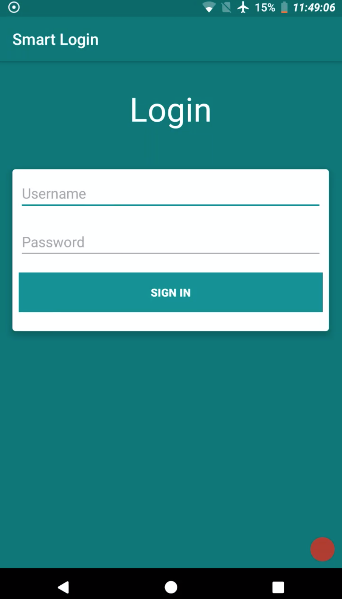
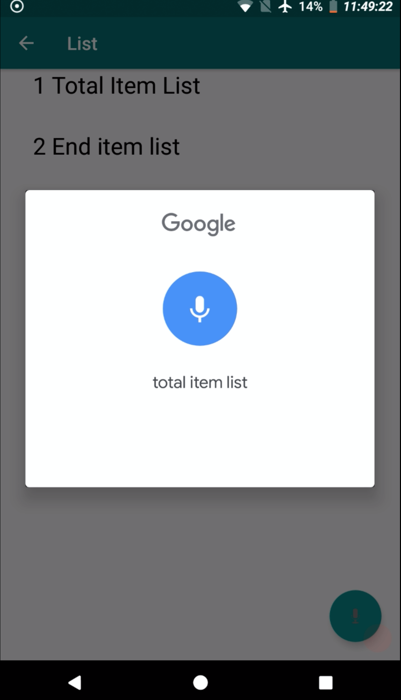
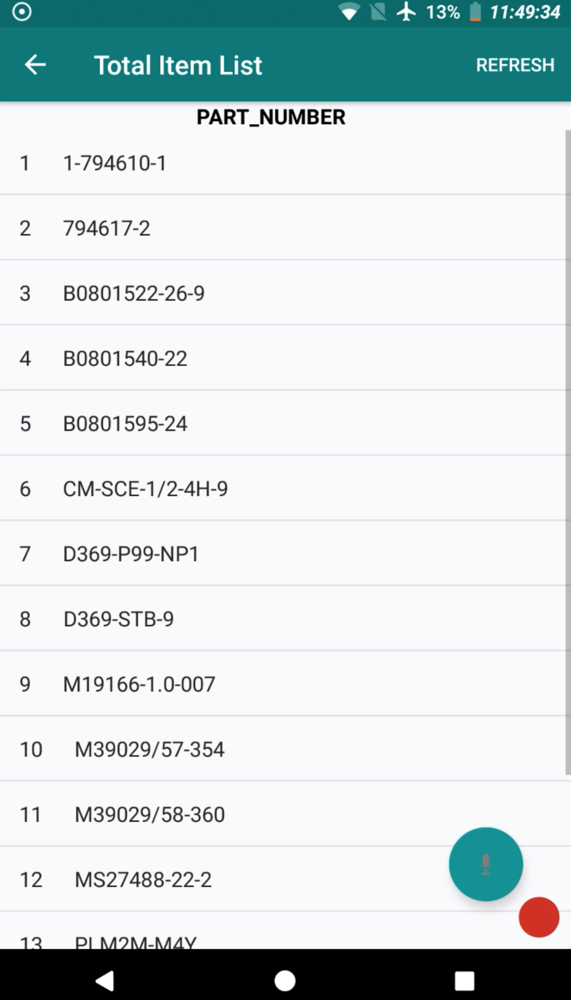
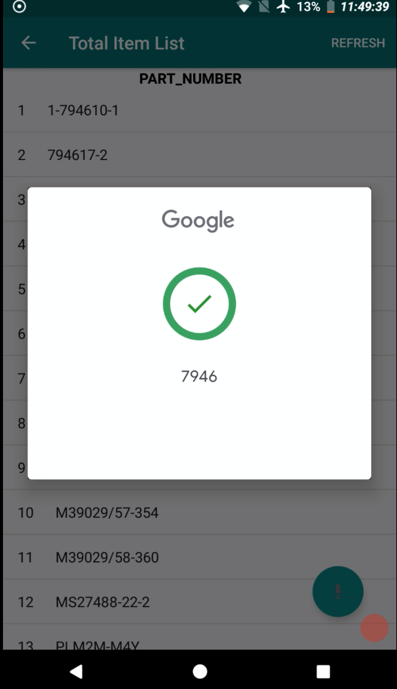
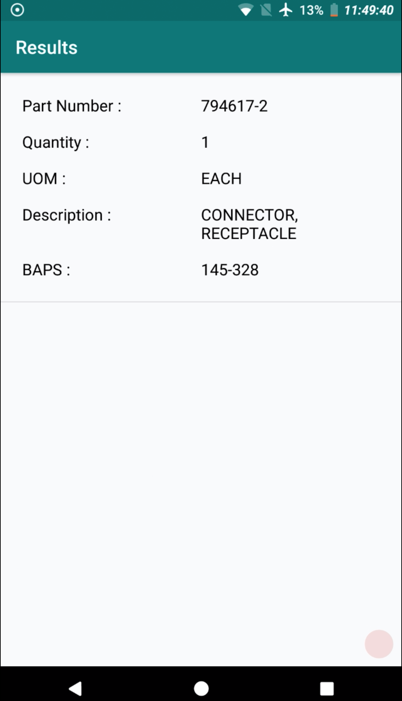

# Wire-Harness
A voice-automated Android Application that queries on an a back-end using Google Sheet as a database .

A wiring harness is an organized set of wires, terminals and connectors that run throughout the entire aircraft and relay information and electric power, thereby playing a critical role in “connecting” a variety of components( ex: various I/O ports on airplane seat). Power and information travel through this network much like the circulatory and central nervous systems (CNS) of the human body.

# Overview of application 
* Login Screen, where each login ID/Password is given by unique set of pre-defined ID's.

A Voice query is made on a Parts Component list comprising of :
* Total item list
* End item list
* Wire List
* 2D drawing
* Connector images

 

Now another query is made for a single sub-component item 

 --> 

