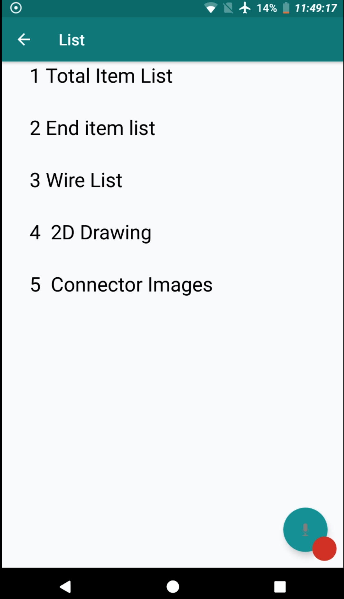

# Wire-Harness
A voice-automated Android Application that queries on an a back-end using Google Sheet as a database 

# Overview of application 
 Login Screen, where each login ID/Password is given by unique set of pre-defined ID's.

B. For a given Wire-Harness part, contains the following system-components and a query is made through voice.

Voice Search

C. A Corresponding sub-component list obtained and queried for a single sub component item 

Query Results

